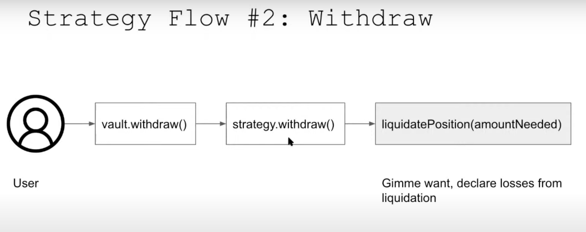

# 🏗 scaffold-eth | 🏰 BuidlGuidl

## 🚩 **Challenge X: Yearn Strategy General Info**

This challenge is focused on guiding students through the following:

- What a Yearn Strategy is
- The typical ins and outs of a Yearn strategy to be aware of that Yearn v2 Vaults take with their actual strategies
- The approach taken to writing this yearn strategy (how @steve0xp got into writing this yearn strategy where he is focused on getting it to ape.tax)
- Writing this yearn strategy and getting experience dealing with some types of the basics.

**This is the first part of 2 challenges focused on writing Yearn strategies.**

1. First challenge - create a super simple strategy to get used to the ins and outs of the `harvest` tx flow.
2. Second challenge - create a strategy atop of Mellow Protocol && Gearbox Protocol w/ tests!

---
### **🚨 DeFi Sub-Branch Context / Disclaimers**

This challenge is part of the DeFi Sub-Branch, where students are invited into writing smart contracts that incorporate actual DeFi protocols. The sub-branch projects are ever-expanding as DeFi is too. The goal of the Defi sub-branch projects/tutorials are to provide students tutorials that foster self-learning in actual DeFi protocols, guide you through some of the basics of integrating with specific protocols, and other useful tips to increase competence to be potentially hireable as an intermediate developer. 

> ❗️ NOTE: **Students taking on this challenge will be expected to embrace self-learning AND it is recommended that they have completed all beginner SRE challenges or show competency elsewhere.** 

<details markdown='1'><summary>👩🏽‍🏫 More Disclaimers </summary>

The required competency is stated simply because tying into other protocols is powerful, and with that comes a lot of responsibility when deploying contracts that may end up holding people's actual funds. These tutorials don't do that but they start to show paths for people to build possible fund-holding code. It is key to know what you are doing.

As well, self-learning is required because tying into DeFi protocols and actual professional crypto projects do not guide developers, step-by-step. If you are new to trying to actually plug into a professional project, no worries! We'll touch on some helpful tips as you sort out what the 'norm' is when going through this process. These tips will be specific to each protocol that we are integrating into and learning about.

</details>

---
## Yearn Strategy Intro Challenge

### Repo Setup
TODO: Change wording here to suit this challenge

To start the project, clone the repo to your local machine using the following CLI commands:

1. Clone the repo onto your local machine and install the submodules: `git clone --recursive <repo link>`

   > NOTE: If you have not installed the submodules, probably because you ran `git clone <repo link>` instead of the CLI command in step 1, you may run into errors when running `forge build` since it is looking for the dependencies for the project. `git submodule update --init --recursive` can be used if you clone the repo without installing the submodules.

2. Install forge on your machine if you have not already: `forge install`

> NOTE: If you need to download the latest version of foundry, just run `foundryup` 

3. Build the project and make sure everything compiles: `forge build`

---

### Simple Yearn Strategy

To kick things off, we'll start by going over the yearn strategy tutorial that Yearn core dev, @charlesndalton, has gone over in this video. Here he covers making a yearn strategy where we pull DAI from the DAIVault in Yearn and deploy it in a lending pool in Compound. If you're not familiar with Compound, they are an OG lending protocol where users can be lenders and borrowers of whitelisted tokens (deemed legitimate through Compound governance).

This tutorial goes over:

- Building a strategy using foundry testing framework
- Video touches on testing with foundry a bit


- For each yVault there are multiple strategies. Example in the above image: DAI is distributed to different strategies where certain amounts have allocations to it.

**Accounting VIP Details**
It's key to know that the strategies take on `debt` from the vaults. AKA some amount of DAI is given to the strategy from the vault. So the strategies below would have some `debt` w/ specified amounts.

Let's first touch on the `harvest` sequences for a typical strategy and then dive a bit deeper into them before coding:

### **`harvest()` sequence**

Typically, yearn strategies have three asset flow scenarios:

1. Increase Debt Ratio (DR) - vault function `deposit()` is used to deposit funds to strategy. Strategy gets adjusted next time bot(typically a keep3r) calls `harvest()` which also acts as an accounting event.

2. `harvest()` calls `adjustPosition()` which then deposits `wantToken` into strategy assuming `_debtOutstanding = 0`.
Decrease DR - `vault` function `withdraw()` is used to withdraw a specified `_debtOutstanding` from strategy. Strategy calls `prepareReturn(_debtOutstanding)` which then does the accounting to see if a profit was made or not in this harvest. From there it uses `liquidate(_debtOutstanding)` to exit the strategy with required amount of `wantToken`

3. Keep DR and tend() yields: this is not used as much.

**Strategy Flow #1 Detailed (follows video)**

_Don't worry about the bots, we use OP, a template pattern that extends from the template_

`harvest()` is called by a `keep3r` which does the following:
- `prepareReturn(debtOutstanding)` : decelaring accounting losses and gains since the last harvest. `debtOutstanding` is the amount of wantToken that the vault wants back. So within `prepareReturn()` there will be internal calls to liquidate, if needed, some wantToken to obtain the requested amount of `debt` back to the vault from the respective strategy. This is a function that exists in every strategy.
- `adjustPosition(debtOutstanding)` : the inverse of the above, investing any excess `wantToken` into the respective strategy. In this case DAI.


**Strategy Flow #2 Detailed (follows video)**

User withdraws from the vault which calls withdraw from the strategy. This further calls a function called `liquidatePosition(amountNeeded)`. If not enough funds then losses are declared (accounting side of things).

`withdraw()`



**Why Build with Foundry**

- 10x faster WITH fuzzing which is good for catching edge cases (rounding, etc.)
- Fuzzing
- Console.log
- Solidity so less context switching vs testing with Brownie in this case

### Diving into the code

So this is started from a foundry mix that @storming0x made [here](LINK).

The tutorial goes over the changes made that you can will implement into your challenge! *As always, solutions are made but don't peek!!!

In strategy.sol

- import OZ library for math // TODO: not sure we need this anymore actually w/ solidity v8.0
- import CDAI as a constant
   - import ICToken.sol because we are building a compound-DAI strategy. // TODO: add a note stating that this is done through going and getting the interface itself from the repo itself (Include the interface itself here so the tutorial doesn't break but point to where you got it from so students understand how to get interfaces for projets).
    - CDAI will be the pool we're deploying into.

Line of code:

````
import "@openzeppelin/contracts/utils/math/Math.sol";

import "./interfaces/Compound/ICToken.sol";

// inside the contract itself (below)
ICToken internal constant cDAI = ICToken(0x5d3a536E4D6DbD6114cc1Ead35777bAB948E3643);
````

CToken interface details:

function 1: mint()
- amount of DAI is given in, and it gives you the amount of CDAI it's worth.

redeem():
- amount of CDAI that you want to burn and it gives you back however much DAI it's worth.

exchangeRateStored():
- when valuing the CDAI position we have, we multiply the CDAI position by this exchange rate and it gives the value of DAI in CDAI.

### code

In the constructor:

We need to first approve the amount of DAI that we are putting into this CDAI pool. So we're giving the CDAI pool permission to handle our tokens (DAI).

```
want.approve(address(cDAI), type(uint256).max)
```

Let's name the strategy. There is a typical convention as Facu had pointed out in past yearn strategy tutorial videos.

TODO: insert code

### `estimatedTotalAssets()` Implementation

Cool, now we'll go into the next typical function, `estimatedTotalAssets()`

This function is called throughout the general "flow" of a strategy, in particular for accounting purposes. We need to obtain an estimate of total assets in the form of `wantToken`. Write up the implementation for this function so it accounts for the `wantToken` within the strategy itself AND the `wantToken` of the assets within the strategy itself. _hint: don't forget to check if there are any scaling factors applied in your conversions._

<details markdown='1'><summary>👩🏽‍🏫 Solution Code</summary>

As you can see, the exchangeRateStored() is **scaled up** by a factor of 18, so we must normalize the exchange rate by a factor of 18. Here you can see the `estimatedTotalAssets` are the sum of: `wantToken` in the strategy, `assets` converted to `wantToken` and scaled down properly by `1e18`
```
return want.balanceOf(address(this)) + cDAI.balanceOf(address(this)) * cDAI.exchangeRateStored() / 1e18; 
```

</details>

### `prepareReturn()` Implementation

Great! Now we're going to look at the `prepareReturn()` function. It does two things:

1. Prepares `wantToken` to be returned
2. Takes care of accounting (profits and losses since last harvest), and specifies how much debt it can pay back of the `debtOutstanding` in the form of the return param `debtPayment`

The standard flow of things is to:

- calculate total assets and total debt in this strategy. We'll use the previous `estimatedTotalAssets()` function for the former && we can use `totalDebt` function from yearn. 

Write the implementation logic for this function such that it will return the proper params; `_profit, _loss, _debtPayment`

*Note that all will be in `wantToken`

As well, add in a stubbed out function call to a helper function called `withdrawSome()`. This helper function will eventually take care of liquidating enough `wantToken` already deployed in the strategy (CDAI pool) and attempt to get enough to repay the debt being requested. More on this helper function later though.

_hint: you'll want to write conditional logic for when there is a profit vs when there is not_

<details markdown='1'><summary>👩🏽‍🏫 Solution Code</summary>

```
uint256 _totalAssets = estimatedTotalAssets();
uint256 _totalDebt = vault.strategies(address(this)).totalDebt;

if(_totalAssets >= _totalDebt) {
    _profit = _totalAssets - _totalDebt;
    _loss = 0;
} else {
    _profit =0;
    _loss = _totalDebt - _totalAssets;
}

withdrawSome(_debtOutstanding + _profit); // _profit needs to be liquid in wantToken, so `withdrawSome()` takes care of that

uint256 _liquidWant = want.balanceOf(address(this));

// enough to pay profit (partial or full) only
if(_liquidWant <= profit) {
    _profit = _liquidWant;
    _debtPayment = 0;
// enough to pay for all profit and _debtOutstanding (partial or full)

}
```

</details>

### `adjustPosition()` Implementation

The focus of this function is to invest excess `wantToken` into the respective strategy. In this case we're investing any excess DAI into the CDAI pool.

Write the implementation logic such that it invests any excess DAI, based on the `debtOutstanding` param, into the CDAI pool.

_hint: make sure that there are checks implemented to ensure that the excess DAI was truly invested (see ICToken interface return values 😉)_

<details markdown='1'><summary>👩🏽‍🏫 Solution Code</summary>

```
uint256 _daiBal = want.balanceOf(address(this));

if(_daiBal > _debtOutstanding) {
    uint256 _excessDai = _daiBal - _debtOutstanding;
// CToken function mint() gives back a uint256 == 0 if it is successful.
    uint256 _status = cDAI.mint(_excessDai);
    assert(_status == 0);
}

```

</details>

### `withdrawSome()` Implementation

Recall from before that this was the stubbed out function to actually liquidate CDAI to DAI (`wantToken`) as needed.

<details markdown='1'><summary>👩🏽‍🏫 Solution Code</summary>

Recall: passed in param to this function is in DAI, and we need to convert that to CDAI because `redeem` takes a CDAI amount. So multiply by 1e18 and divide by exchange rate!

```
function withdrawSome(uint256 _amountNeeded) internal {
    uint256 _cDaiToBurn =Math.min(_amountNeeded * 1e18 / cDAI.exchangeRateStored());

    uint256 _status = cDAI.redeem(_cDaiToBurn);
    assert(_status == 0);
}   
```

</details>

Nice, now we'll move onto `liquidatePosition()`

### `liquidatePosition()` Implementation

Remember that this is called during the flow "withdraw"

First calculate how much DAIBal we have already. If we have enough daiBal to pay things back then we'll return the amountNeeded accordingly - we'd report 0 loss then.

Otherwise we're going to call withdrawSome(), get more DAI from our strategy, and then check if we have enough.

<details markdown='1'><summary>👩🏽‍🏫 Solution Code</summary>

```
function liquidatePosition(uint256 _amountNeeded) internal override returns (uint256 _liquidateAmount, uint256 _loss) {
    uint256 _daiBal = want.balanceOf(address(this));

    if (_daiBal >= _amountNeeded) {
        return (_amountNeeded, 0);
    }

    withdrawSome(_amountNeeded);

    _daiBal = want.balanceOf(address(this));
    if (_amountNeeded > _daiBal) {
        _liquidatedAmount = _daiBal;
        _loss = _amountNeeded - _daiBal;
    } else {
        _liquidateAmount = _amountNeeded;
    }
}
```

</details>

---
### Try Running Forge Tests

At this point we have all the basic functions written out! Congrats!

Now we'll check that your code actually works. Luckily we're leveraging the working foundry mix from Yearn protocol themselves. Part of their developer relations side of things is to onboard new strategists easily by having them only need to worry about risk vectors associated to their strategy itself. They don't need to worry about the harvest flows, interactions with the vaults, etc. typically! So that means that running `make test` will run the typical integrations tests that are needed to ensure a good working strategy with the rest of the yearn v2 vaults architecture is sound!

_NOTE: `make test` is just a script that ultimately runs a series of `forge test` and you can dig into it more by investigating the yearn foundry mix repo itself with its `package.json`_

Before running your tests you'll need to prepare your `.env` if you haven't already.

> Prepare a `.env` file by copying the `.env.example` file from this repo && populate the necessary environment variables. **Make sure that `.env` is listed in your `.gitignore`!!! It should be by default if you cloned this repo but always make sure.**

Here's some notes on the environment variables you'll need to get:

1. `ETH_RPC_URL`: To deploy the code onto a persistent mainnet fork, you'll need the RPC URL, you can get one from infura or alchemy:

- ```MAINNET_RPC = <insert ETH RPC URL here>```

2. `ETHERSCAN_API_KEY`: Etherscan is the leading block explorer, search, API, and analytics platform for Ethereum. Data from the blockchain can be queried using their avaiable APIs. Head to etherscan.io and set up your account to get your own API keys if you haven't done so already. 

- ```ETHERSCAN_API_KEY = <insert ETHERSCAN_API_KEY here>```

> Make sure you are using latest version of foundry, so that it auto-sources `.env`, otherwise run (while in the root directory): `source .env`

Now test your strategy and run `make test`

At this point you should see that there are some errors actually. Using foundry, you can go through the terminal outputs to find out what went wrong with the code.

There should be two errors that prompt up, and one more as we go along, you'll see 😉

### Troubleshooting

The errors that should have arose at this point are due to the basic integrations tests that Yearn has written up. You can find them in the following directory path: `"./src/test"`

First there's one in `StrategyShutdown.t.sol`:

All the way at the bottom, you'll see a line that states `assertGe(want.balanceOf(address(vault)), _amount); // The vault has all funds`

Replace this with: `assertRelApproxEq(want.balanceOf(address(vault)), _amount, DELTA);`

What you're doing here is replacing the previous line of code with a foundry cheat code that allows some leweigh in the minute losses seen when carrying out this test. It's not perfect, but sometimes losses occurring through several tx executions is bound to happen.

Basically, the two functions: `liquidateAllPositions()` and `prepareMigration()` need to be written.

**Error #1: `liquidateAllPositions()`**

This function's purpose is to liquidate all active positions in the strategy to obtain the `wantToken`, which in this case is DAI.

Your task is to:

- Liquidate any open strategy positions within the Compound DAI contracts
- Ensure that the liquidation was successful

Take a crack at it, and try not to look at the solutions as always. 

_hint: recall how you liquidated positions within `withdrawSome()`_

<details markdown='1'><summary>👩🏽‍🏫 Solution Code</summary>

```
function liquidateAllPositions() internal override returns (uint256) {
        uint256 _status = cDAI.redeem(cDAI.balanceOf(address(this)));
        assert(_status == 0);
        return want.balanceOf(address(this));
    }
```

</details>

Now run `make test` and you should see that only one error remains.

**Error #2: `prepareMigration()`**

This function's purpose is to migrate all tokens that are not the `wantToken` to a new strategy. This may happen because of several reasons including upgrades to the strategy itself. This could happen because the underlying protocol undergoes upgrades to newer versions and the older protocol contracts are deemed obsolete or less relevant for the respective strategy.

Now try writing the implementation. Your task is to write the function so it:

- transfers cDAI from this strategy to a new specified address of the new strategy.

_hint: recall how you liquidated positions within `withdrawSome()`_

<details markdown='1'><summary>👩🏽‍🏫 Solution Code</summary>

```
    function prepareMigration(address _newStrategy) internal override {
        cDAI.transfer(_newStrategy, cDAI.balanceOf(address(this)));
    }
```

</details>

Awesome!!! Now if you run `make test` again you should only see one new failing test. Let's take a look at that one now. It is in the `StrategyOperation.t.sol` file though, and not in your `Strategy.sol` code itself.

Here's a great opportunity to get familiar a bit with how one writes tests with foundry. Foundry enables many functionalities, but a key one is that it keeps development all within Solidity (smart contracts and test writing). There are clear advantages to this when thinking about the nuances that arise when working with EthersJS alternatively. As well the speed of foundry testing is very fast for running things like fuzzing tests.

Open up `StrategyOperations.t.sol` and you should see some TODOs under `testProfitableHarvest(uint256 _amount)`. Here you'll need to write the test code to do the following:

- 'Fake' the simulation of accruing yield in the compound strategy through airdropping DAI into the cDAI contract. You might think that this should be associated to the user depositing into the yearn strategy, but since the yearn strategy already allocated DAI to the cDAI contract on behalf of the user, then the accounting within the yearn vaults should provide the user some yield with respect to when they entered the vault and the strategy.

<details markdown='1'><summary>👩🏽‍🏫 Solution Code</summary>

```
    function testProfitableHarvest(uint256 _amount) public {
        vm.assume(_amount > minFuzzAmt && _amount < maxFuzzAmt);
        deal(address(want), user, _amount);

        // Deposit to the vault
        vm.prank(user);
        want.approve(address(vault), _amount);
        vm.prank(user);
        vault.deposit(_amount);
        assertRelApproxEq(want.balanceOf(address(vault)), _amount, DELTA);

        uint256 beforePps = vault.pricePerShare();

        // Harvest 1: Send funds through the strategy
        skip(1);
        vm.prank(strategist);
        strategy.harvest();
        assertRelApproxEq(strategy.estimatedTotalAssets(), _amount, DELTA);

        address cDAI = 0x5d3a536E4D6DbD6114cc1Ead35777bAB948E3643;
        uint256 daiBalOfPool = want.balanceOf(cDAI);
        uint256 amountToAirdrop = daiBalOfPool / 1000;
        deal(address(want), cDAI, daiBalOfPool + amountToAirdrop);

        // Harvest 2: Realize profit
        skip(1);
        vm.prank(strategist);
        strategy.harvest();
        skip(6 hours);

        uint256 profit = want.balanceOf(address(vault));
        assertGt(strategy.estimatedTotalAssets() + profit, _amount);
        assertGt(vault.pricePerShare(), beforePps);
    }
```

</details>

Now with all that done, run `make test` one more time.

Whew, at this point it should be passing the basic integrations yearn strategy tests though. Further diligence in writing more robust tests is needed followed by detailed peer reviews and audits if you want to see your strategy go to production in Yearn's testing grounds: www.ape.tax

###

**Congratulations!!! You just finished writing your first simple yearn strategy!!!**

As mentioned, this is just a tutorial so don't go deploying this on mainnet yourself with the expectation that it is safe. This tutorial is meant to teach the basics, and there already is a compound strategy that Yearn uses for DAI!


---
## References and Context for Those Interested in How this Tutorial was Made

The DeFi Level 3000 repo is always growing. If you are interested in contributing by writing tutorials that educating others in integrating with a different protocol please open an issue, or even fork the repo and submit a PR or draft PR!

For inspiration and/or reference, we've listed out how this strategy came to be, it was very organic!
### **💡🚶🏻‍♂️ Steps taken when Starting this Yearn Strategy Itself**

A typical professional crypto project will have developer docs to help onboard devs into the respective tech stack. The approach that was taken when writing this yearn strategy was to read through the docs, and jump in to the communication channels offered from the protocol. 

@steve0xp simply wanted to learn how to write yearn strategies, and was fortunate enough to have met some yearn contributors at past conferences and throughout online async communications (being part of their discord, writing threads on their project, etc.).

In the case of getting involved with writing strategies, he simply went onto the Yearn Discord, chatted about building yearn strategies, and was pointed to the [Yearn General Telegram Group Chat](https://t.me/yearnfinance) && eventually the gated Telegram group chat, YFI Boarding School. Here he met other strategists, and core strategists who actually deployed strategies with real funds in them.

> **@steve0xp wrote threads outlining his journey writing this Yearn Strategy, we heavily recommend checking out the respective thread highlighted through different parts of this tutorial.**

>We'll list them out all here now though for easier reference. These offer a general landscape of this tutorial's contents. We will use his journey && strategy as the basis of this tutorial.

<details markdown='1'><summary>👩🏽‍🏫 DRAFT THREADS - TODO: finalize these links once the threads are posted. </summary>

1. [Getting started, conceptualization && initialization](https://typefully.com/t/X7kgQ4J)
2. [Troubleshooting with other devs && discussions](https://typefully.com/t/7viHbCb)
3. [Q/C through writing unit tests](tbd)
4. [Deployment && getting actual dollars into the strategy from yearn vaults](tbd)

</details>

---

### README from @storming0x foundry_strategy_mix

The following are the README details found typically in the foundry_strategy_mix. You would use this to start a brand new strategy (assuming you are building with foundry). The repo is updated periodically so make sure to pull the most recent ones and direct any questions to the Yearn team if you are having any troubles!

<details markdown='1'><summary>👩🏽‍🏫 README.md from @storming0x foundry_strategy_mix </summary>

# Yearn Strategy Foundry Mix

## What you'll find here

- Basic Solidity Smart Contract for creating your own Yearn Strategy ([`Strategy.sol`](src/Strategy.sol))

- Configured github template with Foundry framework for starting your yearn strategy project.

- Sample test suite. ([`tests`](src/test/))

## How does it work for the User

Let's say Alice holds 100 DAI and wants to start earning yield % on them.

For this Alice needs to `DAI.approve(vault.address, 100)`.

Then Alice will call `Vault.deposit(100)`.

Vault will then transfer 100 DAI from Alice to itself, and mint Alice the corresponding shares.

Alice can then redeem those shares using `Vault.withdrawAll()` for the corresponding DAI balance (exchanged at `Vault.pricePerShare()`).

## Installation and Setup

1. To install with [Foundry](https://github.com/gakonst/foundry).

2. Fork this repository (easier) or create a new repository using it as template. [Create from template](https://docs.github.com/en/repositories/creating-and-managing-repositories/creating-a-repository-from-a-template)

3. Clone your newly created repository recursively to include modules.

```sh
git clone --recursive https://github.com/myuser/foundry-yearn-strategy

cd foundry-yearn-strategy
```

NOTE: if you create from template you may need to run the following command to fetch the git submodules (.gitmodules for exact releases) `git submodule init && git submodule update`

4. Build the project.

```sh
make build
```

5. Sign up for [Infura](https://infura.io/) and generate an API key and copy your RPC url. Store it in the `ETH_RPC_URL` environment variable.
NOTE: you can use other services.

6. Use .env file
  1. Make a copy of `.env.example`
  2. Add the values for `ETH_RPC_URL`, `ETHERSCAN_API_KEY` and other example vars
     NOTE: If you set up a global environment variable, that will take precedence.

7. Run tests
```sh
make test
```

## Basic Use

To deploy the demo Yearn Strategy in a development environment:

TODO

## Implementing Strategy Logic

[`src/Strategy.sol`](contracts/Strategy.sol) is where you implement your own logic for your strategy. In particular:

- Create a descriptive name for your strategy via `Strategy.name()`.
- Invest your want tokens via `Strategy.adjustPosition()`.
- Take profits and report losses via `Strategy.prepareReturn()`.
- Unwind enough of your position to payback withdrawals via `Strategy.liquidatePosition()`.
- Unwind all of your positions via `Strategy.exitPosition()`.
- Fill in a way to estimate the total `want` tokens managed by the strategy via `Strategy.estimatedTotalAssets()`.
- Migrate all the positions managed by your strategy via `Strategy.prepareMigration()`.
- Make a list of all position tokens that should be protected against movements via `Strategy.protectedTokens()`.

## Testing

Tests run in fork environment, you need to complete [Installation and Setup](#installation-and-setup) step 6 to be able to run these commands.

```sh
make test
```
Run tests with traces (very useful)

```sh
make trace
```
Run specific test contract (e.g. `test/StrategyOperation.t.sol`)

```sh
make test-contract contract=StrategyOperationsTest
```
Run specific test contract with traces (e.g. `test/StrategyOperation.t.sol`)

```sh
make trace-contract contract=StrategyOperationsTest
```

See here for some tips on testing [`Testing Tips`](https://book.getfoundry.sh/forge/tests.html)

## Deploying Contracts

You can Deploy and verify your strategies if PRIV_KEY and ETHERSCAN_API_KEY are both set in the .env by using the command

```sh
make deploy
```

Before deploying, update the constructor-args variable within the Makefile to include any parameters applicable. Make sure to seperate each argument only by a space, no commas.

The deploy script is coded to deploy the "Strategy" contract within the Strategy.sol file. This can be updated by simply updating to src/YourContract.sol:YourContract.

## GitHub Actions

This template comes with GitHub Actions pre-configured. Your contracts will be linted and tested on every push to
`master` and `develop` branch.

Note though that to make this work, you must set your `INFURA_API_KEY` and your `ETHERSCAN_API_KEY` as GitHub secrets.

# Resources

- Yearn [Discord channel](https://discord.com/invite/6PNv2nF/)
- [Getting help on Foundry](https://github.com/gakonst/foundry#getting-help)
- [Forge Standard Lib](https://github.com/brockelmore/forge-std)
- [Awesome Foundry](https://github.com/crisgarner/awesome-foundry)
- [Foundry Book](https://book.getfoundry.sh/)
- [Learn Foundry Tutorial](https://www.youtube.com/watch?v=Rp_V7bYiTCM)


</details>